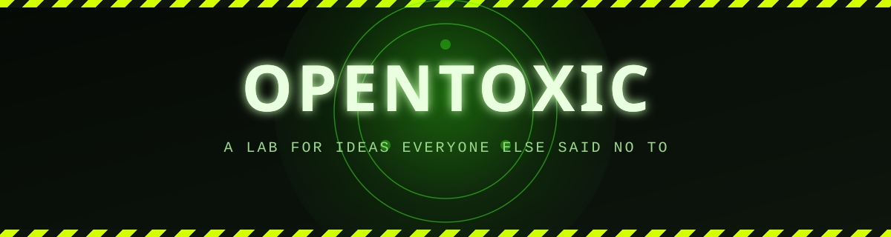

<div align="center">



<br/>


</div>

<br/>

> [!WARNING]
> Everything in this org was, at some point, told *"that's not how you're supposed to do it."*
> We did it anyway. Then we wrote a README.

<br/>

## The premise

Every codebase has a graveyard: the PR closed with *"let's not,"* the RFC that died in
review, the group-chat idea at 2 AM that made everyone laugh and then everyone forgot.
OpenToxic is where those go instead of dying. We dig them back up, give them a repo, and
ship them — spec be damned, roadmap be damned, occasionally taste be damned.

We are not optimizing for best practice. Best practice is what last year's toxic idea
looked like right before it got boring. We're optimizing for the reaction where a senior
engineer goes quiet for a second and says *"...huh, okay, actually."*

<br/>

## How toxic is it, really

Every repo ships with an honest rating, right there in its own README:

&nbsp;&nbsp;
<br/>
&nbsp;&nbsp;
<br/>
&nbsp;&nbsp;
<br/>
&nbsp;&nbsp;

If it's a bit, the label says it's a bit. If it quietly became load-bearing infrastructure
for somebody's side project, the label says that too — usually with visible discomfort.

<br/>

## Standing orders

**Ship the weird version.** The safe one already exists, built by people paid more than us
to make it boring.

**No gatekept commits.** A bad first PR is a rite of passage here, not a rejection.

**Write the docs straight, even when the idea isn't.** Chaos in the code, clarity in the
README — that's the whole deal.

**"Toxic" describes the ideas, not the people.** Corrosive to convention, not to each
other. Bring the chaos, leave the cruelty at the door.

<br/>

<details>
<summary><b>What you'll actually find in here</b> — click to expand</summary>
<br/>

A rotating stockpile of tools, protocols nobody commissioned, abstractions that shouldn't
exist and yet measurably improve on the ones that do, and the occasional repo that started
as a dare and ended up in somebody's production stack without their manager ever finding
out how it got there.

```diff
- "this violates at least four design principles"
+ "yes, and it's twice as fast"
```

</details>

<br/>

## Joining the lab

Open a PR. Open an issue. Open a discussion purely to argue that one of our ideas is bad —
we will probably agree, and ship it anyway. If you've got a toxic idea that needs a lab to
grow in, this is the lab.

<br/>

<div align="center">

<sub><b>HANDLE WITH CURIOSITY — NOT WITH CARE</b></sub>

</div>
